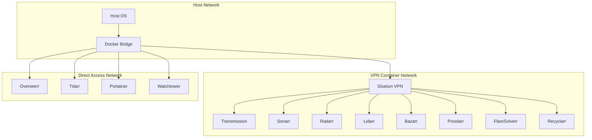

# 🔧 Enterprise ARR Stack - Technical Reference

> **Complete technical documentation for developers and advanced users**

## 📋 Table of Contents

- [🏗️ Architecture Overview](#️-architecture-overview)
- [🔧 Configuration Reference](#-configuration-reference)
- [🐳 Container Specifications](#-container-specifications)
- [🔌 API Documentation](#-api-documentation)
- [📊 Monitoring & Metrics](#-monitoring--metrics)
- [🔒 Security Implementation](#-security-implementation)
- [🛠️ Customization Guide](#️-customization-guide)
- [📈 Performance Optimization](#-performance-optimization)
- [🔄 Backup Architecture](#-backup-architecture)
- [🐛 Debugging Guide](#-debugging-guide)

---

## 🏗️ Architecture Overview

### 🌐 Network Architecture

```yaml
# Network topology
networks:
  arr-network:
    driver: bridge
    ipam:
      config:
        - subnet: 172.28.0.0/16
```

#### VPN Network Isolation



### 📦 Container Dependencies

```yaml
# Dependency chain
gluetun: []
transmission: [gluetun]
prowlarr: [gluetun]
sonarr: [gluetun, prowlarr]
radarr: [gluetun, prowlarr]
lidarr: [gluetun, prowlarr]
bazarr: [gluetun, sonarr, radarr]
overseerr: [sonarr, radarr]
recyclarr: [gluetun, sonarr, radarr]
```

---

## 🔧 Configuration Reference

### 🌍 Environment Variables

#### Core System Configuration
```env
# User & Permissions
PUID=1000                    # User ID for file permissions
PGID=1000                    # Group ID for file permissions
TZ=Europe/Copenhagen         # Timezone
UMASK=002                    # File creation mask

# Base Paths
DATA_PATH=./data             # Main data directory
TDARR_PLUGINS_PATH=./tdarr/plugins
PORTAINER_LICENSE=./portainer/portainer.lic
```

#### VPN Configuration (Mullvad)
```env
# Mullvad WireGuard Configuration
MULLVAD_PRIVATE_KEY=your_private_key_here
MULLVAD_ADDRESSES=10.x.x.x/32

# DNS Security Settings
VPN_DNS_ADDRESS=10.64.0.1    # Mullvad DNS
VPN_DOT=on                   # DNS over TLS
VPN_BLOCK_MALICIOUS=on       # Malware blocking
VPN_BLOCK_ADS=off            # Ad blocking (disabled)
```

#### Service Ports
```env
# Application Ports
TRANSMISSION_PORT=9091
PROWLARR_PORT=9696
SONARR_PORT=8989
RADARR_PORT=7878
LIDARR_PORT=8686
BAZARR_PORT=6767
OVERSEERR_PORT=5055
FLARESOLVERR_PORT=8191
TDARR_WEBUI_PORT=8265
TDARR_SERVER_PORT=8266
```

#### Performance Tuning
```env
# Transmission Performance
TRANSMISSION_PEER_LIMIT_GLOBAL=240
TRANSMISSION_PEER_LIMIT_PER_TORRENT=60
TRANSMISSION_SPEED_LIMIT_DOWN=0        # Unlimited
TRANSMISSION_SPEED_LIMIT_UP=1000       # 1MB/s
TRANSMISSION_RATIO_LIMIT=2.0
TRANSMISSION_IDLE_SEEDING_LIMIT=30     # Minutes
```

### 🔐 API Keys Configuration

```env
# Service API Keys (Generate in each service UI)
PROWLARR_API_KEY=32_character_hex_string
SONARR_API_KEY=32_character_hex_string
RADARR_API_KEY=32_character_hex_string
LIDARR_API_KEY=32_character_hex_string
BAZARR_API_KEY=32_character_hex_string
```

---

## 🐳 Container Specifications

### 📊 Resource Allocation

| Service | Memory Limit | Memory Reserved | CPU Priority |
|---------|-------------|-----------------|--------------|
| **Gluetun** | 512M | 256M | Normal |
| **Transmission** | 1G | 512M | High |
| **Prowlarr** | 512M | 256M | Normal |
| **Sonarr** | 2G | 1G | High |
| **Radarr** | 2G | 1G | High |
| **Lidarr** | 1G | 512M | Normal |
| **Bazarr** | 1G | 512M | Normal |
| **Overseerr** | 1G | 512M | Normal |
| **Tdarr** | 4G | 1G | High |
| **Recyclarr** | 256M | 128M | Low |
| **Portainer** | 512M | 256M | Normal |
| **Watchtower** | 256M | 128M | Low |

### 🏥 Health Check Configuration

```yaml
# Health check intervals and timeouts
healthcheck_intervals:
  critical_services: 30s     # Transmission, Gluetun
  arr_services: 2m          # Sonarr, Radarr, Lidarr, Bazarr
  management: 5m            # Recyclarr
  
healthcheck_timeouts:
  standard: 10s
  extended: 30s             # For heavy services
  
healthcheck_retries: 3
healthcheck_start_period: 30s
```

### 📁 Volume Mappings

```yaml
volumes:
  # Configuration volumes (Docker managed)
  gluetun_data: {}
  transmission_config: {}
  prowlarr_config: {}
  sonarr_config: {}
  radarr_config: {}
  lidarr_config: {}
  bazarr_config: {}
  overseerr_config: {}
  tdarr_server: {}
  tdarr_configs: {}
  tdarr_logs: {}
  recyclarr_config: {}
  portainer_data: {}
  
  # Host bind mounts
  data_bind: "./data:/data"
  tdarr_cache_bind: "./data/tdarr_cache:/temp"
  plugins_bind: "./tdarr/plugins:/app/server/Tdarr/Plugins/Local"
  recyclarr_config_bind: "./recyclarr.yml:/config/recyclarr.yml:ro"
```

---

## 🔌 API Documentation

### 🔗 Internal Service Communication

#### API Endpoints
```yaml
# Internal container communication
transmission:
  base_url: "http://transmission:9091"
  auth: "basic"
  endpoints:
    - "/transmission/rpc"
    - "/transmission/web/"

prowlarr:
  base_url: "http://prowlarr:9696"
  auth: "api_key"
  endpoints:
    - "/api/v1/indexer"
    - "/api/v1/download"

sonarr:
  base_url: "http://sonarr:8989"
  auth: "api_key"
  endpoints:
    - "/api/v3/series"
    - "/api/v3/episode"
    - "/api/v3/downloadclient"

radarr:
  base_url: "http://radarr:7878"
  auth: "api_key"
  endpoints:
    - "/api/v3/movie"
    - "/api/v3/downloadclient"
```

#### Integration Configuration
```json
{
  "download_client": {
    "implementation": "Transmission",
    "configContract": "TransmissionSettings",
    "settings": {
      "host": "transmission",
      "port": 9091,
      "username": "${TRANSMISSION_USER}",
      "password": "${TRANSMISSION_PASS}",
      "category": "sonarr",
      "directory": "/downloads/complete"
    }
  }
}
```

### 🔄 Automation Workflows

#### Quality Profile Sync (Recyclarr)
```yaml
# recyclarr.yml configuration
sonarr:
  web-1080p-v4:
    base_url: http://sonarr:8989
    api_key: !env_var SONARR_API_KEY
    quality_definition:
      type: series
    quality_profiles:
      - name: WEB-1080p
        quality_sort: top
        qualities:
          - name: WEB 1080p
            min: 0
            max: null
```

---

## 📊 Monitoring & Metrics

### 🏥 Health Monitoring

#### Health Check Implementation
```bash
#!/bin/bash
# Example health check script for services

# Transmission health check
curl -f -u "${TRANSMISSION_USER}:${TRANSMISSION_PASS}" \
  "http://localhost:9091/transmission/web/" || exit 1

# API-based health checks
curl -f -H "X-Api-Key: ${SONARR_API_KEY}" \
  "http://localhost:8989/api/v3/system/status" || exit 1
```

#### Monitoring Endpoints
```yaml
monitoring_urls:
  system_status:
    - "http://localhost:8989/api/v3/system/status"  # Sonarr
    - "http://localhost:7878/api/v3/system/status"  # Radarr
    - "http://localhost:8686/api/v1/system/status"  # Lidarr
  
  health_checks:
    - "http://localhost:9091/transmission/web/"     # Transmission
    - "http://localhost:9696/ping"                  # Prowlarr
    - "http://localhost:6767/api/system/status"     # Bazarr
```

### 📈 Performance Metrics

#### Resource Usage Collection
```powershell
# PowerShell monitoring script
function Get-ContainerMetrics {
    $containers = @(
        'gluetun', 'transmission', 'sonarr', 'radarr',
        'lidarr', 'bazarr', 'prowlarr', 'overseerr', 'tdarr'
    )
    
    foreach ($container in $containers) {
        docker stats $container --no-stream --format "table {{.Name}}\t{{.CPUPerc}}\t{{.MemUsage}}\t{{.NetIO}}\t{{.BlockIO}}"
    }
}
```

---

## 🔒 Security Implementation

### 🛡️ Network Security

#### VPN Kill Switch
```yaml
# Gluetun configuration ensures no traffic leaks
gluetun:
  environment:
    - FIREWALL=on
    - FIREWALL_VPN_INPUT_PORTS=51413
    - FIREWALL_INPUT_PORTS=9091,9696,8989,7878,8686,6767,8191
    - DNS_KEEP_NAMESERVER=off  # Prevents DNS leaks
```

#### Container Isolation
```yaml
# Network mode configuration prevents direct internet access
transmission:
  network_mode: "service:gluetun"  # Forces all traffic through VPN
sonarr:
  network_mode: "service:gluetun"
# ... other services
```

### 🔐 Authentication Security

#### API Key Management
```bash
# Generate secure API keys (32 characters hex)
openssl rand -hex 16

# Example API key validation
API_KEY_PATTERN="^[a-f0-9]{32}$"
```

#### Password Security
```env
# Strong password requirements
TRANSMISSION_USER=admin
TRANSMISSION_PASS=generate_strong_password_here  # Min 12 chars, mixed case, numbers, symbols
```

### 🔍 Security Auditing

```bash
#!/bin/bash
# Security audit script

# Check for exposed services
netstat -tlnp | grep -E ':9091|:8989|:7878'

# Verify VPN connection
EXTERNAL_IP=$(docker exec transmission wget -qO- http://httpbin.org/ip)
echo "External IP: $EXTERNAL_IP"

# Check container permissions
docker exec sonarr id

# Verify file permissions
docker exec sonarr ls -la /config
```

---

## 🛠️ Customization Guide

### 🎨 Adding New Services

#### Service Template
```yaml
# Template for adding new service
new-service:
  <<: *common-properties
  image: linuxserver/new-service:latest
  container_name: new-service
  network_mode: "service:gluetun"  # If needs VPN protection
  # OR
  networks:                        # If direct access needed
    - arr-network
  depends_on:
    gluetun:
      condition: service_healthy
  environment:
    - PUID=${PUID}
    - PGID=${PGID}
    - TZ=${TZ}
  volumes:
    - new_service_config:/config
  ports:
    - ${NEW_SERVICE_PORT}:${NEW_SERVICE_PORT}
  healthcheck:
    test: ["CMD", "curl", "-f", "http://localhost:${NEW_SERVICE_PORT}"]
    interval: 2m
    timeout: 10s
    retries: 3
  deploy:
    resources:
      limits:
        memory: 512M
      reservations:
        memory: 256M
```

### 🔧 Custom Scripts

#### Backup Script Customization
```powershell
# Custom backup script example
param(
    [string]$BackupPath = "C:\ARR-Stack\backups",
    [int]$RetentionDays = 7,
    [switch]$IncludeMedia
)

# Custom backup logic
function Backup-CustomData {
    if ($IncludeMedia) {
        # Include media files in backup
        Compress-Archive -Path "C:\ARR-Stack\data\media" -DestinationPath "$BackupPath\media_$(Get-Date -Format 'yyyy-MM-dd').zip"
    }
}
```

### 🎛️ Advanced Configuration

#### Custom Quality Profiles
```json
{
  "name": "Ultra HD",
  "upgradeAllowed": true,
  "cutoff": 2160,
  "items": [
    {
      "quality": {
        "id": 16,
        "name": "HDTV-2160p"
      },
      "allowed": true
    },
    {
      "quality": {
        "id": 18,
        "name": "WEBDL-2160p"
      },
      "allowed": true
    }
  ]
}
```

---

## 📈 Performance Optimization

### ⚡ Docker Optimization

#### Docker Daemon Configuration
```json
{
  "log-driver": "json-file",
  "log-opts": {
    "max-size": "10m",
    "max-file": "3"
  },
  "storage-driver": "overlay2",
  "default-ulimits": {
    "nofile": {
      "Hard": 64000,
      "Name": "nofile",
      "Soft": 64000
    }
  }
}
```

#### Container Optimization
```yaml
# Optimized container configuration
services:
  sonarr:
    # Memory optimization
    deploy:
      resources:
        limits:
          memory: 2G
        reservations:
          memory: 1G
    # Storage optimization
    tmpfs:
      - /tmp
      - /var/tmp
    # Network optimization
    sysctls:
      - net.core.rmem_max=26214400
      - net.core.rmem_default=262144
```

### 🚀 System Performance

#### File System Optimization
```bash
# Optimize ext4 for media files
mount -o noatime,data=writeback /dev/sdb1 /data

# SSD optimization
echo deadline > /sys/block/sda/queue/scheduler
```

#### Network Performance
```yaml
# Network optimization in docker-compose
networks:
  arr-network:
    driver: bridge
    driver_opts:
      com.docker.network.driver.mtu: 1500
    ipam:
      config:
        - subnet: 172.28.0.0/16
          gateway: 172.28.0.1
```

---

## 🔄 Backup Architecture

### 💾 Backup Strategy

#### Backup Components
```yaml
backup_components:
  critical:
    - docker_volumes      # All service configurations
    - env_file           # Environment variables
    - compose_file       # Docker composition
    - recyclarr_config   # Quality profiles
  
  optional:
    - tdarr_plugins      # Custom transcoding rules
    - custom_scripts     # User modifications
    - logs              # Application logs
  
  excluded:
    - media_files        # Too large, recreatable
    - cache_directories  # Temporary data
    - incomplete_downloads
```

#### Backup Schedule
```yaml
schedule:
  full_backup:
    frequency: daily
    time: "23:00"
    retention: 7_days
  
  incremental_backup:
    frequency: hourly
    retention: 24_hours
  
  weekly_backup:
    frequency: weekly
    time: "02:00"
    retention: 4_weeks
```

### 🔄 Restore Procedures

#### Disaster Recovery
```powershell
# Complete system restore procedure
function Restore-ARRStack {
    param(
        [string]$BackupFile,
        [string]$RestorePath = "C:\ARR-Stack"
    )
    
    # Stop all services
    docker-compose down
    
    # Restore volumes
    docker volume ls -q | ForEach-Object {
        docker volume rm $_
    }
    
    # Extract backup
    Expand-Archive -Path $BackupFile -DestinationPath $RestorePath
    
    # Restart services
    docker-compose up -d
    
    # Verify restoration
    Start-Sleep 30
    .\scripts\2_Manual_Control\status.ps1
}
```

---

## 🐛 Debugging Guide

### 🔍 Diagnostic Tools

#### Container Debugging
```bash
# Container inspection
docker inspect container_name | jq '.[]'

# Network debugging
docker network ls
docker network inspect arr-network

# Volume inspection
docker volume inspect sonarr_config

# Resource usage
docker stats --no-stream

# Process monitoring
docker exec sonarr ps aux
```

#### Log Analysis
```bash
# Follow logs for multiple services
docker-compose logs -f sonarr radarr transmission

# Search logs for errors
docker-compose logs sonarr 2>&1 | grep -i error

# Export logs for analysis
docker-compose logs --no-color > system_logs.txt
```

### 🔧 Common Issues

#### VPN Connection Issues
```bash
# Diagnose VPN connectivity
docker exec gluetun ip route
docker exec gluetun nslookup google.com
docker exec gluetun wget -qO- http://httpbin.org/ip

# Check firewall rules
docker exec gluetun iptables -L
```

#### Service Communication Issues
```bash
# Test internal connectivity
docker exec sonarr ping transmission
docker exec sonarr curl -I http://transmission:9091

# Check port accessibility
docker exec sonarr netstat -tlnp
```

#### Performance Issues
```bash
# Check disk I/O
docker exec sonarr iostat -x 1

# Memory usage analysis
docker exec sonarr free -h
docker exec sonarr cat /proc/meminfo

# CPU analysis
docker exec sonarr top -b -n 1
```

---

## 📚 Development Guidelines

### 🏗️ Code Standards

#### Docker Compose Best Practices
- Use YAML anchors for common properties
- Implement comprehensive health checks
- Set appropriate resource limits
- Use semantic versioning for images
- Implement proper dependency ordering

#### Script Development
- Use PowerShell ISE or VS Code for development
- Implement proper error handling
- Add comprehensive logging
- Use approved PowerShell verbs
- Include help documentation

### 🧪 Testing Procedures

#### Integration Testing
```powershell
# Test suite for system validation
function Test-ARRStack {
    $tests = @(
        @{ Name = "VPN Connection"; Test = { Test-VPNConnection } },
        @{ Name = "Service Health"; Test = { Test-ServiceHealth } },
        @{ Name = "API Connectivity"; Test = { Test-APIConnectivity } },
        @{ Name = "Download Functionality"; Test = { Test-DownloadFunction } }
    )
    
    foreach ($test in $tests) {
        Write-Host "Running: $($test.Name)"
        $result = & $test.Test
        Write-Host "Result: $result"
    }
}
```

---

**🔧 This technical reference provides complete implementation details for the Enterprise ARR Stack.**

*For user-friendly guides, see USER_GUIDE.md and INSTALLATION_GUIDE.md*
